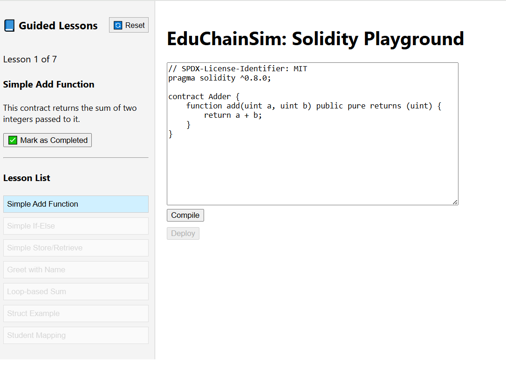
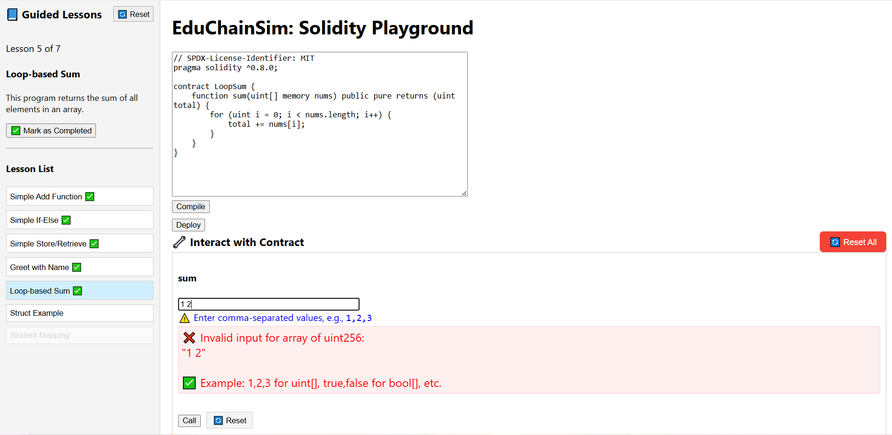
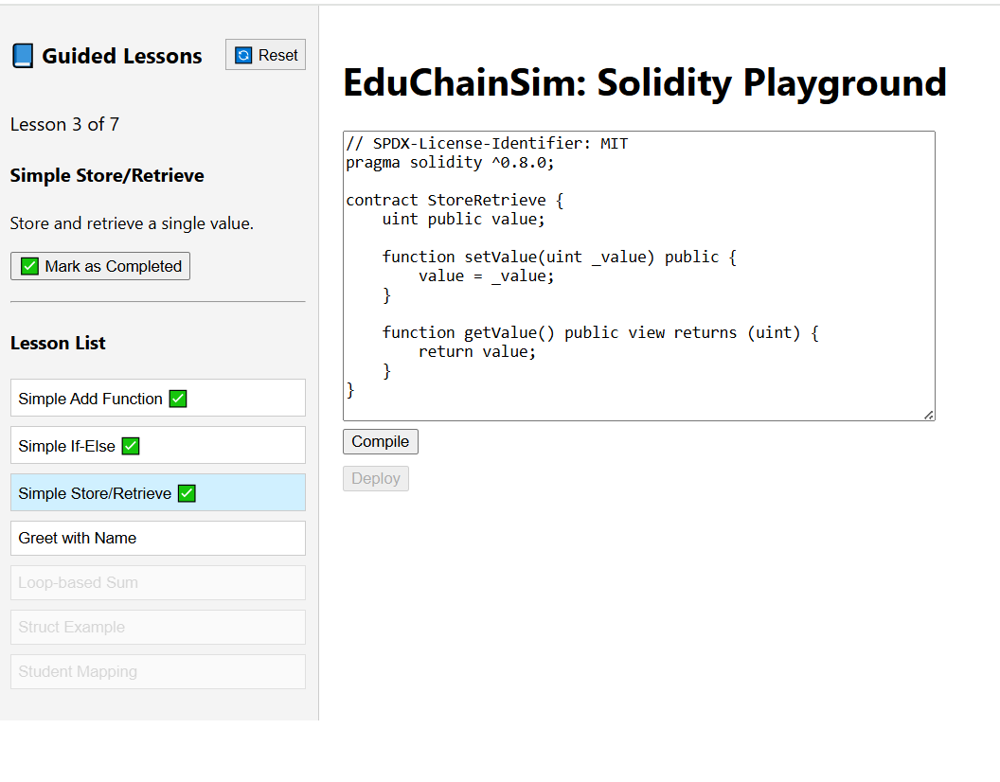
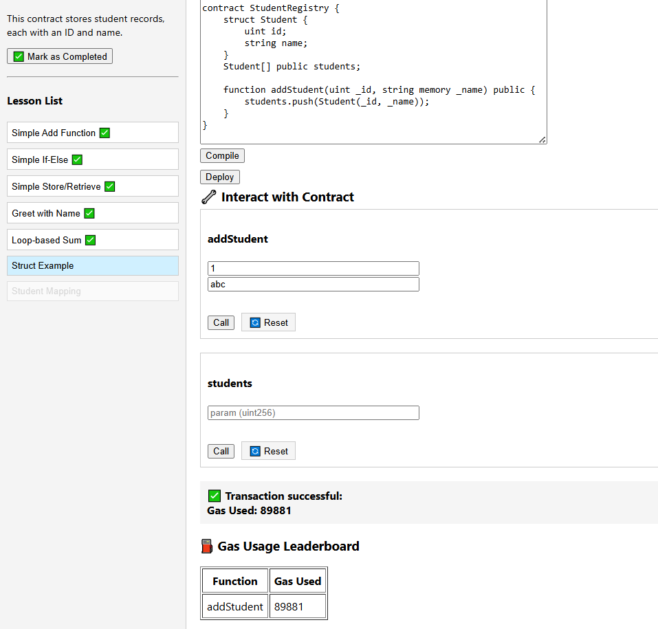

## EduChainSim: Solidity Playground

EduChainSim is an interactive learning tool designed to help students, developers, and enthusiasts learn, write, and test Solidity smart contracts in a guided and user-friendly environment.


 Features

-	In-browser Solidity Code Editor with syntax highlighting

-	Compile Contracts via backend integration 

-	Deploy to Local Blockchain (Hardhat)

-	Interact with Deployed Contracts using a dynamic ABI-based form

-	Gas Usage Leaderboard to compare function call costs

-	Guided Lessons Sidebar with beginner-friendly examples and unlockable content

-	Validation Messages to guide users on complex input types like structs and arrays 


 ## 📸 Screenshots

### ✍️ Solidity Code Editor


### 🔧 Function Interaction Interface


### 📘 Guided Lessons Sidebar


### 📊 Gas Usage Leaderboard
Shows how much gas each function call used. Helps learners compare efficiency.



 
 ## 📚 Why EduChainSim?

Learning smart contract development is challenging due to:

- Complicated setup (solc, Hardhat, MetaMask, etc.)

- No real-time feedback for code changes

- Difficult concepts (ABI encoding, gas usage, structs)

EduChainSim solves this by:

- Providing a browser-based editor + live compiler

- Visualizing contract execution & gas usage

- Including interactive, guided Solidity lessons

 ## 🔧 How to Run Locally

1. Clone the Repository

```bash
git clone https://github.com/Rumpa-Dey/EduChainSim.git
cd EduChainSim

2. Install Dependencies

cd frontend
npm install
cd ../backend
npm install

3. Start Local Blockchain

npx hardhat node

4. Start Backend Compiler Server

cd backend
node server.js

5. Start Frontend

cd frontend
npm start

Now open http://localhost:3000 in your browser

```

## 🛣️ Roadmap
 

| Milestone                     | Status       |
|------------------------------|--------------|
| ✅ Compile, Deploy, Interact | Complete     |
| ✅ Gas Usage Leaderboard     | Complete     |
| ✅ Guided Lesson Sidebar     | Complete     |
| 🧠 Save Progress (localStorage) | Coming Soon |
| 🌐 Deploy to Testnet         | Planned      |
| 📝 Add Quizzes & Assessments| In Progress  |
| 🔗 Shareable Code Sessions   | Planned      |


## Lesson Examples
 
Sample smart contracts included in the guided lessons:

- Adding two numbers

- Conditional logic (if/else)

- State variables (set/get)

- String manipulation

- Arrays and loops

- Structs and mappings


## Contributions & Feedback

We welcome:

- Bug reports

- Feature suggestions

- Pull requests

Email us at: contact2anikid@gmail.com


## License

This project is licensed under the MIT License.

Happy Learning! 

Empowering the next generation of Web3 developers.

